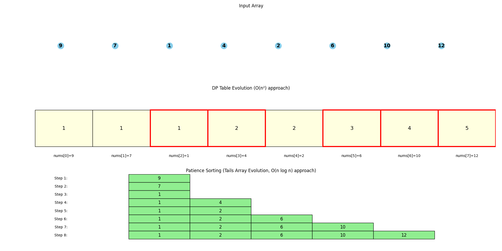

# Longest Increasing Subsequence (LIS)

**Description:**
Given an array of integers `nums`, find the length of the longest strictly increasing subsequence.

**Constraints:**
- `1 <= nums.length <= 2500`
- `-10^4 <= nums[i] <= 10^4`

## Examples:
Example 1:

Input: nums = [9, 7, 1, 4, 2, 6, 10, 12]
Output: 5

Example 2:

Input: nums = [5, 4, 3, 2, 1]
Output: 1

Example 3:

Input: nums = [1, 3, 4, 6, 7, 8]
Output: 6

Example 4:

Input: nums = [2, 2, 2, 2]
Output: 1

Example 5:

Input: nums = []
Output: 0

#### Visualization

### Approaches

#### 1. Dynamic Programming (O(n^2))
- For each element, look at all following elements to build up the length of the LIS ending at that element.

**Steps:**

1. Create an array `dp` of the same length as `nums`, initialized to 1 (each element is an LIS of length 1 by itself).
2. For each index `i` from the end to the start:
    - For each index `j` from `i+1` to the end:
        - If `nums[i] < nums[j]`, set `dp[i] = max(dp[i], 1 + dp[j])`.
3. The answer is the maximum value in `dp`.

#### 2. Patience Sorting / Binary Search (O(n log n))
- Use a list to keep track of the smallest possible tail of all increasing subsequences of different lengths.

**Steps:**
1. Initialize an empty array `tails`.
2. For each number in `nums`:
    - Use binary search to find the leftmost index in `tails` where the number is not less than the current number.
    - If such an index exists, replace `tails[index]` with the number; otherwise, append the number to `tails`.
3. The length of `tails` is the length of the LIS.

| Approach      | Time Complexity | Space Complexity | Notes              |
| ------------- | --------------- | ---------------- | ------------------ |
| DP (O(n^2))   | O(n^2)          | O(n)             | Simple, clear      |
| Binary Search | O(n log n)      | O(n)             | Fastest, preferred |

#### Edge Cases
- Empty array: Should return 0.
- All elements equal: Should return 1.
- Strictly decreasing: Should return 1.
- Strictly increasing: Should return length of array.
- Invalid input (not an array): Should throw an error.

**Time and Space complexity:**
- The dynamic programming approach has a time complexity of `O(n^2)`, where `n` is the number of elements in the array, because for each element we may compare it to every other element after it. The space complexity is `O(n)` due to the `dp` array.
- The patience sorting (binary search) approach has a time complexity of `O(n log n)` and a space complexity of `O(n)`, as it maintains a list of tails for the subsequences.
