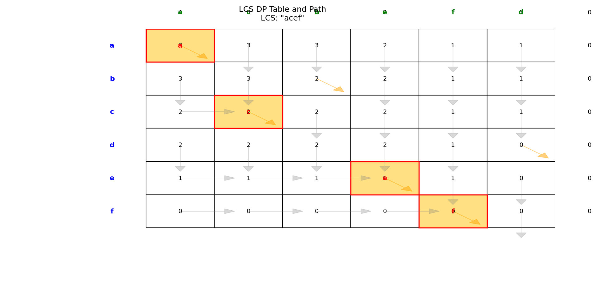

**Description:**
Given two strings `str1` and `str2`, find the length of their longest common subsequence. Return 0 if there is no common subsequence.

**Constraints:**
- `1 <= str1.length, str2.length <= 1000`
- `str1` and `str2` consist of lowercase English letters.

## Examples:
Example 1:

Input: str1 = 'abcdef', str2 = 'acbefd'
Output: 4

Example 2:

Input: str1 = 'abcd', str2 = 'efgh'
Output: 0

Example 3:

Input: str1 = 'abc', str2 = 'abc'
Output: 3

Example 4:

Input: str1 = '', str2 = 'abc'
Output: 0

### Visualization

### Approaches

#### 1. Dynamic Programming (Bottom-Up 2D Array)
- Build a 2D array where `dp[i][j]` is the length of the LCS of `str1[i:]` and `str2[j:]`.

**Steps:**
1. Create a 2D array `dp` of size `(m+1) x (n+1)` initialized to 0, where `m` and `n` are the lengths of `str1` and `str2`.
2. Iterate `i` from `m-1` to `0` and `j` from `n-1` to `0`:
    - If `str1[i] == str2[j]`, set `dp[i][j] = 1 + dp[i+1][j+1]`.
    - Else, set `dp[i][j] = max(dp[i+1][j], dp[i][j+1])`.
3. The answer is `dp[0][0]`.

#### 2. Recursive with Memoization
- Recursively compute the LCS length, memoizing results to avoid recomputation.

**Steps:**
1. Define a helper function with indices `i` and `j` for `str1` and `str2`.
2. If either index reaches the end of its string, return 0.
3. If the result for `(i, j)` is memoized, return it.
4. If `str1[i] == str2[j]`, return `1 + helper(i+1, j+1)`.
5. Else, return `max(helper(i+1, j), helper(i, j+1))`.
6. Memoize and return the result.

#### 3. Reconstructing the Actual LCS
- After filling the DP table, trace back from `dp[0][0]` to reconstruct the LCS string.

**Steps:**
1. Start at `i = 0, j = 0`.
2. If `str1[i] == str2[j]`, add the character to the LCS and increment both indices.
3. Else, move in the direction of the larger value between `dp[i+1][j]` and `dp[i][j+1]`.
4. Repeat until the end of either string is reached.

| Approach       | Time Complexity | Space Complexity | Notes                                |
| -------------- | --------------- | ---------------- | ------------------------------------ |
| DP (2D Array)  | O(m * n)        | O(m * n)         | Standard, reconstructs LCS           |
| Recursive+Memo | O(m * n)        | O(m * n)         | Elegant, not as fast for large input |

**Time and Space complexity:**
- The dynamic programming approach has a time complexity of `O(m * n)`, where `m` and `n` are the lengths of the two strings. The space complexity is also `O(m * n)` due to the 2D DP array.
- The recursive with memoization approach also has a time complexity and space complexity of `O(m * n)` due to memoization.
