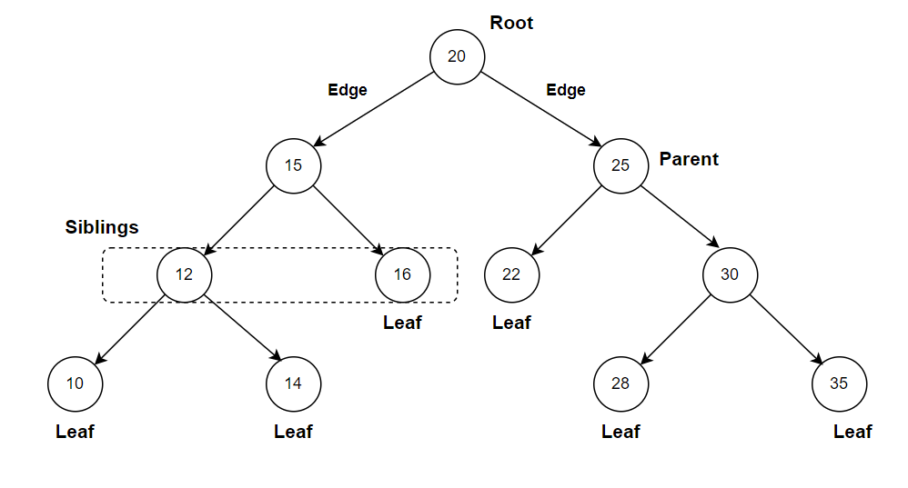
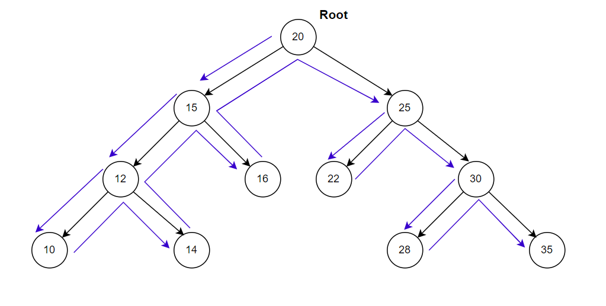
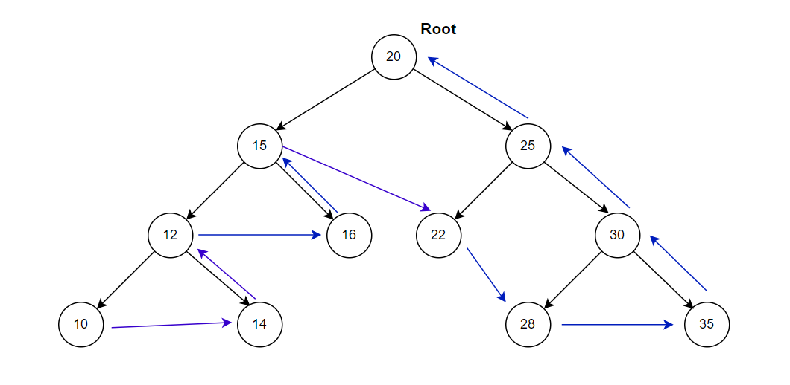

# Binary Search Tree (BST)

A Binary Search Tree (BST) is a hierarchical data structure where each node has at most two children, and the values are organized in a specific order: all values in the left subtree are less than the root, and all values in the right subtree are greater than the root.

## Properties
- **Left Subtree**: All nodes have values less than the parent node
- **Right Subtree**: All nodes have values greater than the parent node
- **No Duplicates**: Each value appears only once (in this implementation)
- **Recursive Structure**: Each subtree is also a BST

## Types of BSTs

1. **Full Binary Search Tree**: Each node has either 0 or 2 children
2. **Complete Binary Search Tree**: All levels are filled except possibly the last level, which is filled from left to right
3. **Perfect Binary Search Tree**: Both full and complete, with all leaf nodes at the same depth

## Structure

## Methods

### 1. Insert
**Description**: Inserts a new value into the BST while maintaining the BST property.

**Algorithm**:
1. If the tree is empty, create a new root node
2. Compare the new value with the current node
3. If the value is less than the current node, go to the left subtree
4. If the value is greater than the current node, go to the right subtree
5. If the value is equal, do nothing (duplicate handling)
6. Repeat until finding an empty position and insert the new node

**Time Complexity**: O(h) where h is the height of the tree
- Best case: O(log n) for balanced trees
- Worst case: O(n) for skewed trees

### 2. Lookup
**Description**: Searches for a value in the BST and returns true if found, false otherwise.

**Algorithm**:
1. Start from the root
2. Compare the target value with the current node
3. If the value is less than the current node, go to the left subtree
4. If the value is greater than the current node, go to the right subtree
5. If the value is equal, return true
6. If we reach a null node, return false

**Time Complexity**: O(h) where h is the height of the tree
- Best case: O(log n) for balanced trees
- Worst case: O(n) for skewed trees

### 3. Min Value Node
**Description**: Finds the node with the minimum value in a subtree.

**Algorithm**:
1. Start from the given node
2. Keep traversing to the left child until reaching a node with no left child
3. Return that node

**Time Complexity**: O(h) where h is the height of the subtree

### 4. Max Value Node
**Description**: Finds the node with the maximum value in a subtree.

**Algorithm**:
1. Start from the given node
2. Keep traversing to the right child until reaching a node with no right child
3. Return that node

**Time Complexity**: O(h) where h is the height of the subtree

### 5. Breadth-First Search (BFS)
**Description**: Traverses the tree level by level, visiting all nodes at the current level before moving to the next level.

**Algorithm**:
1. Use a queue to keep track of nodes to visit
2. Start with the root node in the queue
3. While the queue is not empty:
   - Remove the first node from the queue
   - Add its value to the result
   - Add its left and right children to the queue (if they exist)

**Time Complexity**: O(n) where n is the number of nodes

**Space Complexity**: O(w) where w is the maximum width of the tree

**Example Output**: [20, 15, 25, 12, 16, 22, 30, 10, 14, 28, 35]

### 6. Depth-First Search (DFS)

#### Pre-Order Traversal
**Description**: Visits nodes in the order: Root → Left → Right

**Algorithm**:
1. Visit the current node
2. Recursively traverse the left subtree
3. Recursively traverse the right subtree

**Time Complexity**: O(n)

**Example Output**: [20, 15, 12, 10, 14, 16, 25, 22, 30, 28, 35]

#### In-Order Traversal
**Description**: Visits nodes in the order: Left → Root → Right

**Algorithm**:
1. Recursively traverse the left subtree
2. Visit the current node
3. Recursively traverse the right subtree

**Time Complexity**: O(n)

**Example Output**: [10, 12, 14, 15, 16, 20, 22, 25, 28, 30, 35]

#### Post-Order Traversal
**Description**: Visits nodes in the order: Left → Right → Root

**Algorithm**:
1. Recursively traverse the left subtree
2. Recursively traverse the right subtree
3. Visit the current node

**Time Complexity**: O(n)

**Example Output**: [10, 14, 12, 16, 15, 22, 28, 35, 30, 25, 20]

## Advantages
- Fast search, insert, and delete operations (O(log n) average case)
- Maintains sorted order
- Efficient for range queries
- Memory efficient

## Disadvantages
- Performance degrades to O(n) for skewed trees
- No built-in balancing mechanism
- Complex deletion operation (not implemented in this version)

## Applications
- Database indexing
- File system organization
- Symbol tables in compilers
- Priority queues
- Range queries